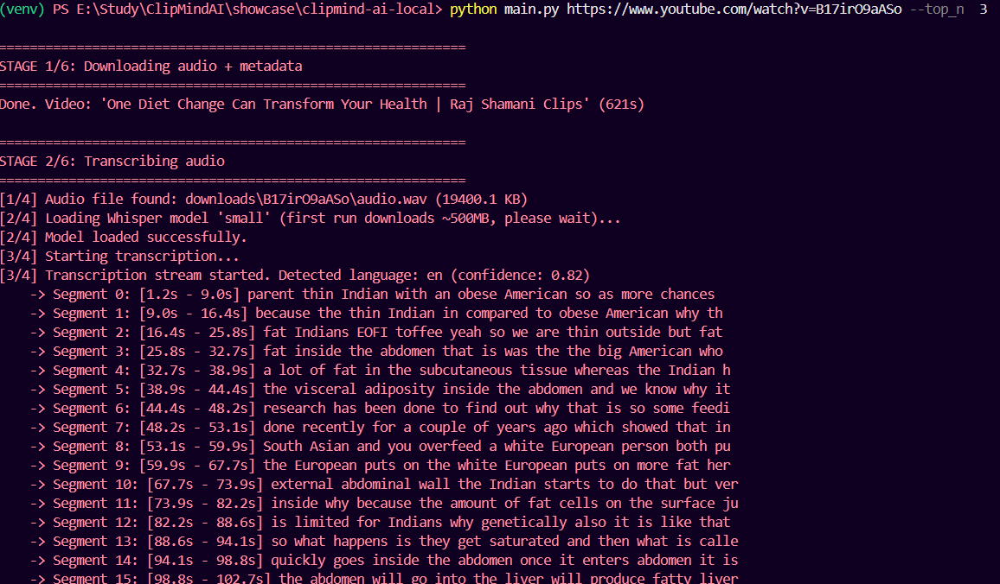

# ClipMind AI
Python 3.11

MIT License

CLI

Whisper

Groq

FFmpeg

**AI-powered short-form clip generation from long-form YouTube videos**

Long-form podcasts and interviews often contain dozens of valuable insights, but manually finding short, engaging clips is time-consuming. ClipMind AI was built to automate that workflow by combining transcription, topic understanding, narrative analysis, computer vision, and video rendering into a single local pipeline that transforms a YouTube URL into ready-to-share vertical clips.

ClipMind AI takes a long-form YouTube video (podcasts, interviews, lectures, talks) and automatically produces ready-to-post vertical Shorts — complete with active-speaker-tracking crop and burned-in captions — by understanding *what's being discussed* and *where the best hook-to-payoff moment lives* within each topic, rather than just scoring random sentences.

>A fully working local pipeline built using freely available tools and open-source components..

---

## What it actually does

Give it a YouTube URL. It will:

1. Download the audio and transcribe it (word-level timestamps)
2. Split the transcript into topically coherent sections
3. Within each topic, find the best **hook → build → payoff** clip — not just the single highest-scoring sentence, but a genuine narrative arc, so the exciting part lands at the *end*, not buried in the middle
4. Rank every candidate clip **relative to the others** from the same video, so you get a real top-N, not a pile of clips that all score identically
5. Download just the needed video segments (not the whole source video)
6. Detect the active speaker frame-by-frame and dynamically crop to 9:16 vertical, following whoever's talking — instead of a naive fixed center-crop
7. Burn in styled, word-synced captions using the original transcript timestamps

One command, one YouTube link in — a folder of finished, captioned, vertical Shorts out.

# Example result
Input

45-minute nutrition podcast

↓

Output

3 Shorts

34 seconds

41 seconds

52 seconds

## Visuals 

# Original Video over youtube


## Processing Steps 

# Downloading audio+metadata and then transcribing 


# Segmentation and Topic wise clip selection


# Ranking clips 


# Downloading Top ranked video clips, dynamic cropping by active speaker detection and caption burning


# Metadata (Title, description and hashtags) generation for generated clips


```bash
python main.py "https://www.youtube.com/watch?v=VIDEO_ID" --top_n 3
```
VIDEO_ID
    │   audio.wav
    │   final_clips.json
    │   final_clips_ranked.json
    │   final_clips_v2.json
    │   final_scored_clips.json
    │   heuristic_scores.json
    │   metadata.json
    │   topics.json
    │   transcript.json
    │   
    └───rendered_clips
            clip_1_final.ass
            clip_1_final.mp4
            clip_1_raw.mp4
            clip_1_raw_speaker_timeline.json
            clip_1_vertical.mp4
            clip_2_captioned.ass
            clip_2_captioned.mp4
            clip_2_final.ass
            clip_2_final.mp4
            clip_2_raw.mp4
            clip_2_raw_speaker_timeline.json
            clip_2_vertical.mp4
            clip_2_vertical_TEST.mp4
            clip_3_final.ass
            clip_3_final.mp4
            clip_3_raw.mp4
            clip_3_raw_speaker_timeline.json
            clip_3_vertical.mp4
            debug_frame_22s.jpg
            debug_frame_27s.jpg
            debug_frame_31s.jpg
            debug_raw_frame_6s.jpg
            render_manifest.json
---

## Why this is different from "just scoring sentences"

Most naive approaches to this problem score individual transcript segments in isolation and stitch together whatever scores highest. That tends to produce clips that either drag on with no clear point, or peak too early and trail off. ClipMind AI instead:

- **Segments by topic first**, so a clip never accidentally straddles two unrelated ideas
- **Explicitly looks for narrative structure** (a tease/question, a build, a resolution) within each topic, rather than a single "best" line
- **Ranks clips against each other**, not in isolation, avoiding the common failure mode where every candidate ends up with a near-identical, meaningless score
- **Tracks the active speaker visually** (via lip-movement analysis) so multi-speaker footage doesn't get cropped into empty background

---

## Pipeline architecture

```
YouTube URL
   │
   ▼
[Ingestion]        yt-dlp + ffmpeg  →  audio.wav + metadata.json
   │
   ▼
[Transcription]    faster-whisper (CPU)  →  transcript.json (word + segment timestamps)
   │
   ▼
[Topic Segmentation]   LLM (Groq)  →  topics.json
   │
   ▼
[Arc-Based Clip Selection]  LLM (Groq)  →  final_clips_v2.json
   │        (hook/payoff detection, duration enforcement, sentence-completion check)
   ▼
[Relative Ranking]     LLM (Groq)  →  final_clips_ranked.json
   │
   ▼
[Rendering]
   ├─ Active speaker detection (MediaPipe Face Mesh, mouth-movement tracking)
   ├─ Dynamic 9:16 crop (ffmpeg, instant-cut speaker following)
   └─ Caption burn-in (.ass subtitles, ffmpeg)
   │
   ▼
Final captioned vertical clips
```

---

## Tech stack

| Layer | Tools |
|---|---|
| Ingestion | `yt-dlp`, `ffmpeg-python` |
| Transcription | `faster-whisper` (CPU, int8 quantized) |
| LLM reasoning | `Groq` API (`llama-3.3-70b-versatile`), with local `Ollama` (`llama3.2:3b`) as an offline fallback |
| Computer vision | `mediapipe` (Face Mesh), `opencv-python` |
| Video processing | `ffmpeg` (dynamic crop filters, subtitle burn-in) |
| Language | Python 3.11 |

Everything runs on free-tier tools — no paid API keys are required to run this project.

---

## Project structure

```
code/
├── src/
│   ├── ingestion/        # YouTube download (audio + targeted video segments)
│   ├── transcription/    # Whisper-based transcription
│   ├── scoring/           # Topic segmentation, arc-based clip selection, ranking
│   └── rendering/         # Speaker detection, dynamic crop, caption burn-in
├── main.py                # Full pipeline orchestrator — single entry point
├── requirements.txt
└── .env.example
```

---

## Setup

```bash
git clone <this-repo-url>
cd code
python -m venv venv
venv\Scripts\activate        # Windows
pip install -r requirements.txt
pip install  mediapipe==0.10.9 --no-deps
pip install protobuf==3.20.3

**Note:** mediapipe and protobuf are installed as separate final steps due to a known dependency conflict between mediapipe's legacy Solutions API (which requires an older protobuf) and onnxruntime (which requires a newer one). Installing them in this specific order avoids the conflict while keeping both packages functional. See the "Known Limitations" section below for details.
```

You'll also need:
- **FFmpeg** installed and on PATH
- A free **Groq API key** ([console.groq.com](https://console.groq.com)) — copy `.env.example` to `.env` and add it
- **Ollama** installed with a local model pulled (`ollama pull llama3.2:3b`) as an offline LLM fallback

Then run the whole pipeline on any YouTube video:
```bash
python main.py "https://www.youtube.com/watch?v=VIDEO_ID" --top_n 5
```

---

## Known limitations (honest)

This is an actively developed personal project, not a finished commercial product. Current known limitations:

- **Transcription accuracy drops** on non-English audio with heavy background music — a documented, known Whisper behavior, not specific to this project.
- **Active speaker detection** can lose tracking briefly on steep downward face angles (mitigated with gap-filling, not eliminated).
- **No web UI yet** — currently a CLI pipeline; a UI is planned.
- **YouTube's bot-detection measures** occasionally require a fresh cookie export for `yt-dlp` to keep working — a known, ongoing friction point for any yt-dlp-based tool.

These are documented deliberately, not hidden — they reflect real, working engineering decisions made under genuine constraints (free-tier APIs, consumer hardware, no GPU).

---

## Roadmap

- [ ] Web UI for upload/review/export
- [ ] Auto-generated titles, descriptions, and hashtags per clip
- [ ] Audio source separation for cleaner transcription on music-heavy content
- [ ] Direct publishing integrations (YouTube Shorts / Instagram Reels APIs)

---

## Author

Built solo, developed iteratively with detailed devlogs documenting design decisions, bugs found, and fixes applied throughout.